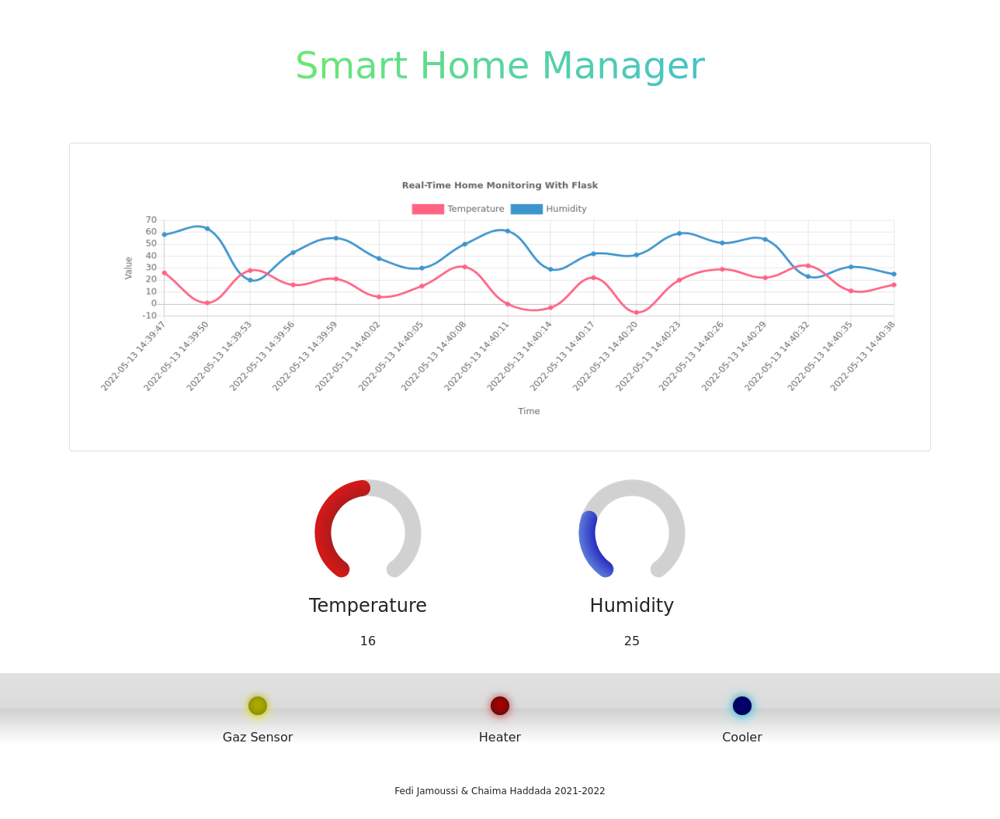

# IOT-Weather-Monitor
A realtime IOT application for the Raspberry Pi that collects humidity and temperature values and cools or heats the room accordingly.
It also has smoke detection features thanks to a gaz sensor and it can start an alarm on detection.

The backend was made in python using Flask and the frontend was made using html, css and javascript.  
This app was made as a mini-project for the 2021-2022 IOT course.

# Screenshots

# Resources
## Flask
* [Streaming Contents — Flask Documentation (1.1.x)](https://flask.palletsprojects.com/en/1.1.x/patterns/streaming/#streaming-with-context)
## HTML
* [CSS LED Lights](https://codepen.io/fskirschbaum/pen/MYJNaj)
## Javascript
* [Chart.js: Simple HTML5 Charts using the <canvas> tag](https://github.com/chartjs/Chart.js)
* [gauge.js: 100% native and cool looking JavaScript gauge](https://github.com/bernii/gauge.js/)
